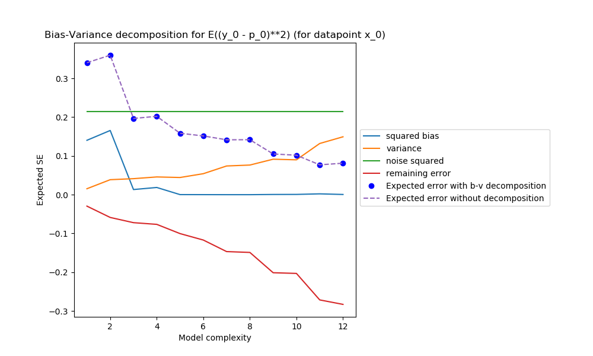

# Bias Variance Decomposition demo

Demo in python for showing how the error is decomposed in different terms

During the following proof (http://www.inf.ed.ac.uk/teaching/courses/mlsc/Notes/Lecture4/BiasVariance.pdf) some terms related to epsilon (noise) are set to 0 because E(epsilon) = 0. Of course in real data E(epsilon) it is not exactly 0.

In this demo we show how the expected squared error is equal to bias_squared + variance + noise_variance + remaining_errors_due_to_noise.
When n_trials (numbers of measurements on fx) is very large then the last term can be neglected. For this demo we consider this term for academic purposes.
    
We show bias-variance decomposition on the sin(x) function and observe how the error components evolve as the complexity of the model changes.

The expected squared error for training point 0 is shown next:

While the E(MSE) over all training points is:

We notice how the the sum of the components in the error decomposition matches exactly the expected mean squared error when the "remaining_errors_due_to_noise" are added to the sum.
When n_trials is large this term tends to 0. 

As the complexity becomes larger, the variance increases (overfits the data) and the bias is reduced.

Finally we can see how the train-test error curves evolve for different model complexities.

